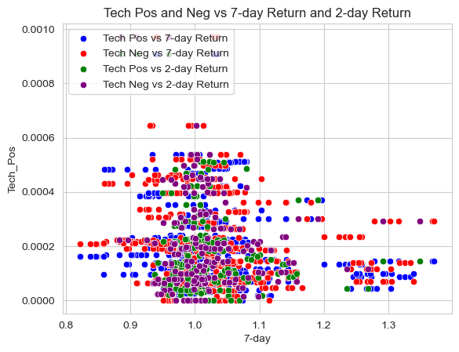

# Analysis Report


```python
import pandas as pd
import seaborn as sns
import matplotlib.pyplot as plt

analysis_samp = "output/analysis_sample.csv"
analysis_sample = pd.read_csv(analysis_samp)
```

## Abstract
Using two different dictionaries of positive and negative sentiment words and the S&P 500 companies, this code pulls the 10-Ks and stock returns for the respective companies and compares overall sentiments in 10-Ks to stock returns. The NEAR_regex function in python was extremely helpful in calculating the counts of positive and negative sentiments. In addition to finding out the overall positive and negative sentiments for the 10-Ks we also looped through each 10-K to find out how often certain words appeared next to positive and negative sentiment words and their specific effects on the stock returns in the days shortly after. Specifically, I searched for words along the topics of Porters (Sales, Suppliers, Customers, Employees, etc.), Tech (Computers, Robots, AI, Technology, etc.) and Risk (Inflation, Supply Chains, Natural Disasters, Pandemic, etc.)  I found that there was overall a negative correlation with the stock prices even if they were positive words. The main outlier I found that was when Tech was talked about in a negative way there was an extremely high positive correlation with the stock price. In the report below I will get into more detail surrounding specific instances and will visualize the results in order to make patterns more prevalent.

## Variables
### Return
The initial sample used was the S&P 500.
The return variables were built and modified using the NEAR_Regex function in python. To begin, I had to load in the four sentiment dictionaries ```bhr_negative = pd.read_csv('inputs/ML_negative_unigram.txt',header=None)[0].to_list()``` and properly format them in regex formatting using this ```bhr_neg_reg =      '('+'|'.join(bhr_negative)+')'```. From here, I had to load in the sample (S&P500) and and loop through the entire index and extract all of the correlating 10-K HTML files. I then used a function called BeautifulSoup, which can be imported using ```from bs4 import BeautifulSoup```, in order to clean all of the HTML files and put them into proper format to be used with NEAR_regex. Finally,I used the NEAR_regex function ```ML_Pos = len(re.findall(NEAR_regex([bhr_pos_reg]), cleaned))/len(cleaned)``` and calculated the percentage of positive and negative sentiment words in each 10-K. To add a new column for each variable to the sp500 data frame I then used ```sp500.loc[index, 'ML_Pos'] = ML_Pos```.
### Sentiment
The sentiment variables were created in a similar fashion as the return variables except for this line ```Porter_Pos = len(re.findall(NEAR_regex(['(Sales|suppliers|customers|employees|investment|innovation)',bhr_pos_reg],5), cleaned))/len(cleaned)``` which was a slightly more complicated NEAR_regex function. Initially I struggled with the order in which to put the lists and punctuation but after some alterations I was able to obtain a working function that produced results that made sense.

### Topics
I chose the 3 topics I did for my "contextual sentiment" measures because I wanted three extremely different lists. I was particularly interested in technology and its effect because every single day technology is growing more and more important in society. Second, I wanted to see how risks in particular effected the stock returns because we had just recently lived through a pandemic that largely impacted the economy so how they were correlated. Lastly, I chose the Porters list because I wanted to do a list that I believed would have a large amount of hits in each 10-K in order to vary my results.

### Eye Test
My "contextual sentiment" variables pass the eye test, there is nothing fishy, plenty of variation in measure (nothing is almost all 0), and the industries I expect to be talking positively or negatively are (i.e. Risk has a higher negative than positive)

## Summary Stats
When looking at my summary stats, right away the first that jumps out is that there is only 652 rows in the data frame. Unfortunately when running my code for the producing the calculated returns I was only able to get my code to work using the line unique_file_dates = returns_sp500['file_date'].unique(). I am aware that this then means that I will only be using the firms in my sample that had unique filing dates but everything else I tried, including taking out the .unique and trying an index, row loop, almost broke my computer. In the end, I still believe the 85 firms data is still enough to produce results that are able to be analyzed. The only problem I see with the analysis as a result of the missing firms is that we will not be able to see firms and their market responses for the the same any 2 periods. Besides the clear missing data, I also was only able to produce cumulative returns for T-T+2 and T+3-T+10 but was not able to only make it properly count just business days. When looking at the summary stats themselves it is interesting to see that the average 7-day returns and 2-day returns following the release of the 10-K was positive. In addition, it is important to note that the cumulative returns are centered around 1 in my analysis, therefore any cumulative returns below 1 would be a negative returns for that period and anything above 1 is a positive return for that period. When looking at the ML vs the LM it is clear that there were more "hits" from the NEAR_regex function, which is interesting because the ML positive and negative dictionaries was shorter and consisted of less words which initially I thought would result in less hits.


```python
analysis_sample.describe()
```


<div>
<style scoped>
    .dataframe tbody tr th:only-of-type {
        vertical-align: middle;
    }

    .dataframe tbody tr th {
        vertical-align: top;
    }

    .dataframe thead th {
        text-align: right;
    }
</style>
<table border="1" class="dataframe">
  <thead>
    <tr style="text-align: right;">
      <th></th>
      <th>Unnamed: 0</th>
      <th>CIK</th>
      <th>ML_Pos</th>
      <th>ML_Neg</th>
      <th>LM_Pos</th>
      <th>LM_Neg</th>
      <th>Porter_Pos</th>
      <th>Porter_Neg</th>
      <th>Risk_Pos</th>
      <th>Risk_Neg</th>
      <th>...</th>
      <th>cash_a</th>
      <th>xrd_a</th>
      <th>dltt_a</th>
      <th>invopps_FG09</th>
      <th>sales_g</th>
      <th>dv_a</th>
      <th>short_debt</th>
      <th>ret</th>
      <th>7-day</th>
      <th>2-day</th>
    </tr>
  </thead>
  <tbody>
    <tr>
      <th>count</th>
      <td>652.00000</td>
      <td>6.520000e+02</td>
      <td>652.000000</td>
      <td>652.000000</td>
      <td>652.000000</td>
      <td>652.000000</td>
      <td>652.000000</td>
      <td>652.000000</td>
      <td>652.000000</td>
      <td>652.000000</td>
      <td>...</td>
      <td>621.000000</td>
      <td>621.000000</td>
      <td>621.000000</td>
      <td>579.000000</td>
      <td>621.000000</td>
      <td>621.000000</td>
      <td>621.000000</td>
      <td>652.000000</td>
      <td>652.000000</td>
      <td>189.000000</td>
    </tr>
    <tr>
      <th>mean</th>
      <td>325.50000</td>
      <td>7.886351e+05</td>
      <td>0.024872</td>
      <td>0.026541</td>
      <td>0.005225</td>
      <td>0.016356</td>
      <td>0.001691</td>
      <td>0.001984</td>
      <td>0.000156</td>
      <td>0.000311</td>
      <td>...</td>
      <td>0.136487</td>
      <td>0.032530</td>
      <td>0.317128</td>
      <td>2.922886</td>
      <td>0.160558</td>
      <td>0.028915</td>
      <td>0.086618</td>
      <td>0.002387</td>
      <td>1.027581</td>
      <td>1.018590</td>
    </tr>
    <tr>
      <th>std</th>
      <td>188.36047</td>
      <td>5.789311e+05</td>
      <td>0.002504</td>
      <td>0.002885</td>
      <td>0.001105</td>
      <td>0.003227</td>
      <td>0.000600</td>
      <td>0.000589</td>
      <td>0.000167</td>
      <td>0.000255</td>
      <td>...</td>
      <td>0.108716</td>
      <td>0.044193</td>
      <td>0.179615</td>
      <td>1.903650</td>
      <td>0.156834</td>
      <td>0.025016</td>
      <td>0.062808</td>
      <td>0.025945</td>
      <td>0.086147</td>
      <td>0.065624</td>
    </tr>
    <tr>
      <th>min</th>
      <td>0.00000</td>
      <td>2.969000e+03</td>
      <td>0.019389</td>
      <td>0.017226</td>
      <td>0.003061</td>
      <td>0.008865</td>
      <td>0.000678</td>
      <td>0.000286</td>
      <td>0.000000</td>
      <td>0.000017</td>
      <td>...</td>
      <td>0.003713</td>
      <td>0.000000</td>
      <td>0.032278</td>
      <td>0.481436</td>
      <td>-0.082577</td>
      <td>0.000000</td>
      <td>0.004306</td>
      <td>-0.078376</td>
      <td>0.822205</td>
      <td>0.882648</td>
    </tr>
    <tr>
      <th>25%</th>
      <td>162.75000</td>
      <td>1.004930e+05</td>
      <td>0.023044</td>
      <td>0.024399</td>
      <td>0.004435</td>
      <td>0.014318</td>
      <td>0.001258</td>
      <td>0.001655</td>
      <td>0.000050</td>
      <td>0.000137</td>
      <td>...</td>
      <td>0.049990</td>
      <td>0.000000</td>
      <td>0.189640</td>
      <td>1.509511</td>
      <td>0.047763</td>
      <td>0.006395</td>
      <td>0.034633</td>
      <td>-0.010641</td>
      <td>0.976446</td>
      <td>0.982656</td>
    </tr>
    <tr>
      <th>50%</th>
      <td>325.50000</td>
      <td>8.292240e+05</td>
      <td>0.024972</td>
      <td>0.026349</td>
      <td>0.005230</td>
      <td>0.015759</td>
      <td>0.001635</td>
      <td>0.001993</td>
      <td>0.000111</td>
      <td>0.000242</td>
      <td>...</td>
      <td>0.111474</td>
      <td>0.007159</td>
      <td>0.301803</td>
      <td>2.449015</td>
      <td>0.113672</td>
      <td>0.025933</td>
      <td>0.067911</td>
      <td>0.001115</td>
      <td>1.016476</td>
      <td>1.008368</td>
    </tr>
    <tr>
      <th>75%</th>
      <td>488.25000</td>
      <td>1.140859e+06</td>
      <td>0.026500</td>
      <td>0.028663</td>
      <td>0.005846</td>
      <td>0.018256</td>
      <td>0.002100</td>
      <td>0.002372</td>
      <td>0.000193</td>
      <td>0.000409</td>
      <td>...</td>
      <td>0.210811</td>
      <td>0.061962</td>
      <td>0.384653</td>
      <td>3.930926</td>
      <td>0.220771</td>
      <td>0.045559</td>
      <td>0.125555</td>
      <td>0.013475</td>
      <td>1.056125</td>
      <td>1.034890</td>
    </tr>
    <tr>
      <th>max</th>
      <td>651.00000</td>
      <td>1.757898e+06</td>
      <td>0.030676</td>
      <td>0.034878</td>
      <td>0.008642</td>
      <td>0.026658</td>
      <td>0.003226</td>
      <td>0.003675</td>
      <td>0.001087</td>
      <td>0.001198</td>
      <td>...</td>
      <td>0.444828</td>
      <td>0.174006</td>
      <td>1.007041</td>
      <td>9.348215</td>
      <td>0.652428</td>
      <td>0.103745</td>
      <td>0.256825</td>
      <td>0.310995</td>
      <td>1.371429</td>
      <td>1.348567</td>
    </tr>
  </tbody>
</table>
<p>8 rows × 81 columns</p>
</div>


## Discussion Questions
**#1 Compare / contrast the relationship between the returns variable and the two “LM Sentiment” variables (positive and negative) with the relationship between the returns variable and the two “ML Sentiment” variables (positive and negative). Focus on the patterns of the signs of the relationships and the magnitudes.**


The "LM Sentiment" variable has an odd relationship with the 7-Day return because the LM negative is always greater than the LM positive whether the return is high or low. If you look below at the correlation table, you can see that the LM_Neg and LM_Pos variables have a higher negative correlation with the stock returns, which would make sense based on my findings. It is interesting to note that LM_Pos actually has a higher negative correlation than LM_Neg which is not what I expected to find. When looking at the "ML Sentiment" variables and the relationship with the 7-Day returns variable, it is actually opposite to what I would have expected as well. The stocks that saw the highest returns in the period of T+3-T+10 days where T was the 10-K filing date actually had more "hits" for negative words throughout their 10-K which was surprising. I believe there is more of a true effect on stock returns from the "ML Sentiment" variables. Unlike the LM_Pos and LM_Neg, the ML_Neg has a higher negative correlation than ML_Pos. Ultimately, I was surprised to find that all 4 had a negative correlation with the the 7-Day returns and from looking at the graphs, I believe that the negative sentiment words have no statistically significant effect on returns because most of the high returns have a high negative sentiment.

**#2 If your comparison/contrast conflicts with Table 3 of the Garcia, Hu, and Rohrer paper (ML_JFE.pdf, in the repo), discuss and brainstorm possible reasons why you think the results may differ. If your patterns agree, discuss why you think they bothered to include so many more firms and years and additional controls in their study? (It was more work than we did on this midterm, so why do it to get to the same point?)**

My comparison/contrast is different than table 3 of the Garcia, Hu and Rohrer paper mainly because I had to use a smaller sample size (i.e. 85 firms) because my code would not work otherwise. Additionally, another reason our findings could be different is the time of the year they did the study and the current market situation. Another possibility is the specific 10-Ks they pulled could have been particularly more positive or negative and could have had different effects on the market at that time. Some of the findings they had, I had as well, such as LM Positive sentiment words had a negative effect on stock returns which agrees with my findings. In addition, I hypothesized that the negative sentiment words do not have a significant effect on stock returns which is in line with their findings as well.

**#3 Discuss your 3 “contextual” sentiment measures. Do they have a relationship with returns that looks “different enough” from zero to investigate further? If so, make an economic argument for why sentiment in that context can be value relevant.**

My "contextual" sentiment measures have a relationship with returns that looks "different enough" from zero to investigate further. I believe two of three of my measures should be investigated further. First, Porter's list of words having a -.134123 and -.179894 correlation with returns is the farthest away from 0 and I believe this is because it is a list that talks about employees and customers of the company and therefore if they are talked about in a negative way economically it should have a negative effect on stock returns. The second one that should be investigated further is Tech because of the extremely high negative correlation with returns both positive and negative as well. A -.165168 and -0.160903 correlation for the Tech_Pos is extremely high for what is supposed to be a positive effect on stock returns.

**#4 Is there a difference in the sign and magnitude? Speculate on why or why not.**
There is a large difference in the magnitude between the 7-day and 2-Day when looking at the correlation between them and the "ML Sentiment" variable. I believe this is largely in part due to the immediate response on the day of and in the 2 days following the release of the 10-K by companies, and the further out you look there will be less and less of a correlation between the sentiment of the 10-Ks and the stock returns. However, there is no sign difference, there is still a negative correlation between the 7-Day and 2-Day returns and the "ML Sentiment" variables.

## Correlation Matrix
|          | 7-day    | 2-Day    |
|----------|----------|----------|
| ML_Pos   | -0.015989 | -0.086373 |
| ML_Neg   | -0.039233 | -0.087719 |
| LM_Pos   | -0.121103 | -0.148118 |
| LM_Neg   | -0.063470 | -0.070893 |
| Porter_Pos | -0.105408 | -0.213354 |
| Porter_Neg | -0.134123 | -0.179894 |
| Risk_Pos | -0.064131 | -0.094806 |
| Risk_Neg | -0.060263 | -0.128890 |
| Tech_Pos | -0.165168 | -0.160903 |
| Tech_Neg | -0.146511 | -0.113529 |

## ML Pos and Neg vs 7-Day Return and 2-Day Return


```python
sns.set_style("whitegrid")

# create a scatter plot with four different colors
sns.scatterplot(data=analysis_sample, x="7-day", y="ML_Pos", color='blue', label='ML Pos vs 7-day Return')
sns.scatterplot(data=analysis_sample, x="7-day", y="ML_Neg", color='red', label='ML Neg vs 7-day Return')
sns.scatterplot(data=analysis_sample, x="2-day", y="ML_Pos", color='green', label='ML Pos vs 2-day Return')
sns.scatterplot(data=analysis_sample, x="2-day", y="ML_Neg", color='purple', label='ML Neg vs 2-day Return')

# add title and legend
plt.title('ML Pos and Neg vs 7-day Return and 2-Day Return')
plt.legend(loc='upper left')
```


    <matplotlib.legend.Legend at 0x7fead8a5f850>


    

    


## LM Pos and Neg vs 7-Day Return and 2-Day Return


```python
sns.set_style("whitegrid")

# create a scatter plot with four different colors
sns.scatterplot(data=analysis_sample, x="7-day", y="LM_Pos", color='blue', label='LM Pos vs 7-day Return')
sns.scatterplot(data=analysis_sample, x="7-day", y="LM_Neg", color='red', label='LM Neg vs 7-day Return')
sns.scatterplot(data=analysis_sample, x="2-day", y="LM_Pos", color='green', label='LM Pos vs 2-day Return')
sns.scatterplot(data=analysis_sample, x="2-day", y="LM_Neg", color='purple', label='LM Neg vs 2-day Return')

# add title and legend
plt.title('LM Pos and Neg vs 7-day Return and 2-day Return')
plt.legend(loc='upper left')
```


    <matplotlib.legend.Legend at 0x7fead8a6fa30>


    

    


## Risk Pos and Neg vs 7-Day Return and 2-Day Return


```python
sns.set_style("whitegrid")

# create a scatter plot with four different colors
sns.scatterplot(data=analysis_sample, x="7-day", y="Risk_Pos", color='blue', label='Risk Pos vs 7-day Return')
sns.scatterplot(data=analysis_sample, x="7-day", y="Risk_Neg", color='red', label='Risk Neg vs 7-day Return')
sns.scatterplot(data=analysis_sample, x="2-day", y="Risk_Pos", color='green', label='Risk Pos vs 2-day Return')
sns.scatterplot(data=analysis_sample, x="2-day", y="Risk_Neg", color='purple', label='Risk Neg vs 2-day Return')

# add title and legend
plt.title('Risk Pos and Neg vs 7-day Return and 2-day Return')
plt.legend(loc='upper left')
```


    <matplotlib.legend.Legend at 0x7fead8c9dcd0>


    

    


## Porter Pos and Neg vs 7-Day Return and 2-Day Return


```python
sns.set_style("whitegrid")

# create a scatter plot with four different colors
sns.scatterplot(data=analysis_sample, x="7-day", y="Porter_Pos", color='blue', label='Porter Pos vs 7-day Return')
sns.scatterplot(data=analysis_sample, x="7-day", y="Porter_Neg", color='red', label='Porter Neg vs 7-day Return')
sns.scatterplot(data=analysis_sample, x="2-day", y="Porter_Pos", color='green', label='Porter Pos vs 2-day Return')
sns.scatterplot(data=analysis_sample, x="2-day", y="Porter_Neg", color='purple', label='Porter Neg vs 2-day Return')

# add title and legend
plt.title('Porter Pos and Neg vs 7-day Return and 2-day Return')
plt.legend(loc='upper left')
```


    <matplotlib.legend.Legend at 0x7fead8cffbb0>


    

    


## Tech Pos and Neg vs 7-Day Return and 2-Day Return


```python
sns.set_style("whitegrid")

# create a scatter plot with four different colors
sns.scatterplot(data=analysis_sample, x="7-day", y="Tech_Pos", color='blue', label='Tech Pos vs 7-day Return')
sns.scatterplot(data=analysis_sample, x="7-day", y="Tech_Neg", color='red', label='Tech Neg vs 7-day Return')
sns.scatterplot(data=analysis_sample, x="2-day", y="Tech_Pos", color='green', label='Tech Pos vs 2-day Return')
sns.scatterplot(data=analysis_sample, x="2-day", y="Tech_Neg", color='purple', label='Tech Neg vs 2-day Return')

# add title and legend
plt.title('Tech Pos and Neg vs 7-day Return and 2-day Return')
plt.legend(loc='upper left')
```


    <matplotlib.legend.Legend at 0x7fead90d0a00>


    

    

